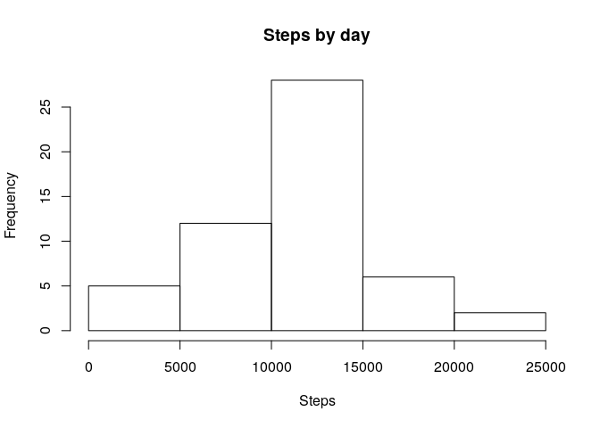
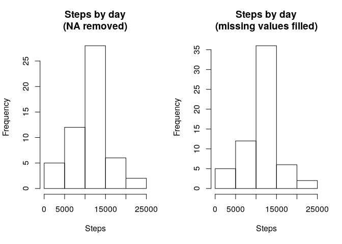

# Step analysis

This project makes use of data from a personal activity monitoring device. This device collects data at 5 minute intervals through out the day. The data consists of two months of data from an anonymous individual collected during the months of October and November, 2012 and include the number of steps taken in 5 minute intervals each day.

## Loading and preprocessing the data

We start by unzipping the data file


```r
unzip('activity.zip')
```

We load file content of activity.csv file into a data frame and check their structure


```r
df <- read.csv('activity.csv',header = TRUE,sep = ',',stringsAsFactors = FALSE)
str(df)
```

```
## 'data.frame':	17568 obs. of  3 variables:
##  $ steps   : int  NA NA NA NA NA NA NA NA NA NA ...
##  $ date    : chr  "2012-10-01" "2012-10-01" "2012-10-01" "2012-10-01" ...
##  $ interval: int  0 5 10 15 20 25 30 35 40 45 ...
```

The data has three columns, *steps*, *date* and *interval*.
We transform "date" column into a true date format.


```r
df$date <- as.Date(df$date,format = '%Y-%m-%d')
```

This finishes the loading and previous transform process. 

## Initial data exploration: What is mean total number of steps taken per day?

Now we'll see some data metrics. In this part of the process NA values are to be ignored. We start with an histogram of daily steps. We need to summarize steps in each day, and library dplyr is perfect for the job.


```r
library(dplyr)
```

```
## 
## Attaching package: 'dplyr'
```

```
## The following objects are masked from 'package:stats':
## 
##     filter, lag
```

```
## The following objects are masked from 'package:base':
## 
##     intersect, setdiff, setequal, union
```

```r
day_summary <- df %>% 
  group_by(date) %>% 
  summarise(steps_by_day = sum(steps,na.rm = TRUE))
```

```
## `summarise()` ungrouping output (override with `.groups` argument)
```

```r
hist(day_summary$steps_by_day,main = 'Steps by day',xlab = 'Steps')
```

<!-- -->

Also we can show some numeric summaries (mean and median data values)


```r
mean(day_summary$steps_by_day,na.rm = TRUE)
```

```
## [1] 9354.23
```

```r
median(day_summary$steps_by_day,na.rm = TRUE)
```

```
## [1] 10395
```

## Data interval averaged properties: What is the average daily activity pattern?

Now we are interested in studding data averaged along the days. The first variable to view is the mean value of steps in each interval.


```r
interval_summary <- df %>% 
  group_by(interval) %>% 
  summarise(steps_by_interval = mean(steps,na.rm = TRUE))
```

```
## `summarise()` ungrouping output (override with `.groups` argument)
```

Now we can make a plot of mean value of steps in each interval


```r
#plot
interval_summary%>% 
  plot(steps_by_interval ~ interval,main = 'Steps by interval (mean value)',ylab = 'Steps',type='l')
```

<!-- -->

There is a large value (~ 200 steps) clearly visible on the left half of the plot. We can easily see when it occurs and the exact number of steps average.


```r
#maximum step average 
interval_summary[interval_summary$steps_by_interval==max(interval_summary$steps_by_interval),]
```

```
## # A tibble: 1 x 2
##   interval steps_by_interval
##      <int>             <dbl>
## 1      835              206.
```

## Imputing missing values

Now we can analyze NA values. 


```r
colSums(is.na(df))
```

```
##    steps     date interval 
##     2304        0        0
```

All missing values are in **steps** column, as expected. We can fill these missing values with the average value corresponding to each interval, with the help of **interval_summary** table previously defined. This choice is very convenient, as it takes into account the differential behavior of steps average along the day.


```r
dff <- merge(df,interval_summary,by='interval')
dff$steps <- ifelse(is.na(dff$steps),dff$steps_by_interval,dff$steps)
dff$steps_by_interval <- NULL
dff <- dff[order(dff$date),]
```

Now we can repeat the summary analysis and explore the change produced by filling missing values. We can plot side by side the histogram of steps by day without NAs and with missing values filled, in order to compare them.


```r
day_summary_f <- dff %>% 
  group_by(date) %>% 
  summarise(steps_by_day = sum(steps,na.rm = TRUE))
```

```
## `summarise()` ungrouping output (override with `.groups` argument)
```

```r
par(mfrow=c(1,2))
hist(day_summary$steps_by_day,main = 'Steps by day\n(NA removed)',xlab = 'Steps')
hist(day_summary_f$steps_by_day,main = 'Steps by day\n(missing values filled)',xlab = 'Steps')
```

<!-- -->

```r
par(mfrow=c(1,1))
```

It appears like mean and median values are enlarged in the new data frame (**dff**). Nevertheless, the maximum steps by day has not changed. We compare the summaries of original (**day_summary**) and filled data (**day_summary_f**) to see this in detail.


```r
summary(day_summary$steps_by_day)
```

```
##    Min. 1st Qu.  Median    Mean 3rd Qu.    Max. 
##       0    6778   10395    9354   12811   21194
```

```r
summary(day_summary_f$steps_by_day)
```

```
##    Min. 1st Qu.  Median    Mean 3rd Qu.    Max. 
##      41    9819   10766   10766   12811   21194
```


## Are there differences in activity patterns between weekdays and weekends?

In order to compare patterns for different weekdays, we introduce a new factor variable **dayType** with levels *weekday* (working day) for days from Mondays to Fridays and *weekend* for Saturdays and Sundays.


```r
dff$dayType <- as.factor(ifelse(weekdays(df$date) %in% c('Saturday','Sunday'),'Weekend','Weekday'))
```

The mean value of steps for each interval, grouping apart each **dayType**, is taken.


```r
interval_weektype_summary_f <- dff %>% 
  group_by(interval,dayType) %>% 
  summarise(steps_by_interval = mean(steps,na.rm = TRUE))
```

```
## `summarise()` regrouping output by 'interval' (override with `.groups` argument)
```

The **dayType** comparison is shown in this pair of plots of step average for interval. We use the **ggplot** library for that.


```r
library(ggplot2)
g <- ggplot(interval_weektype_summary_f,aes(interval,steps_by_interval)) + geom_line()
g <- g + facet_wrap(. ~ dayType,ncol = 1)
g <- g + labs(x="Interval",y="Steps (mean value)") 
g
```

<!-- -->

Two differences are evident. The weekend steps pattern is displaced to greater interval values and the initial high morning peak is lower than then weekdays morning peak. 
